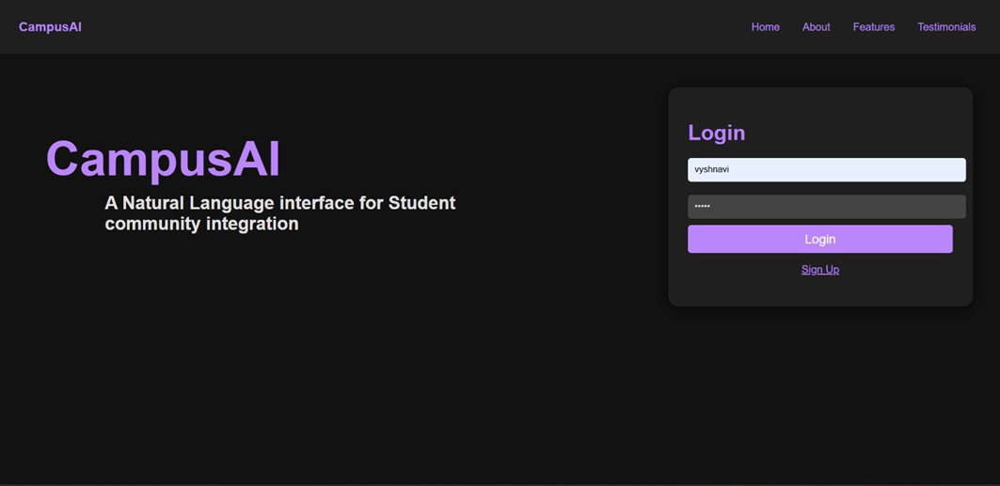
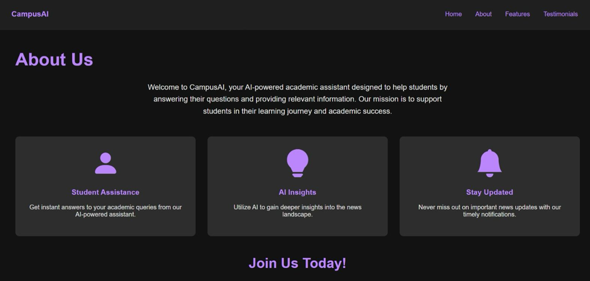
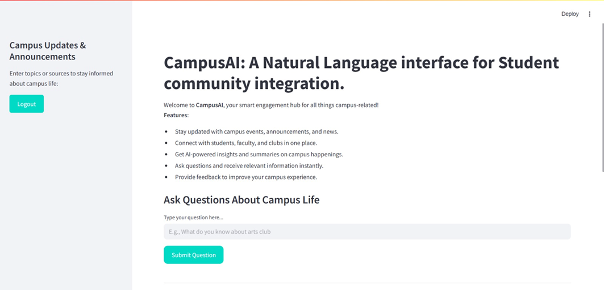
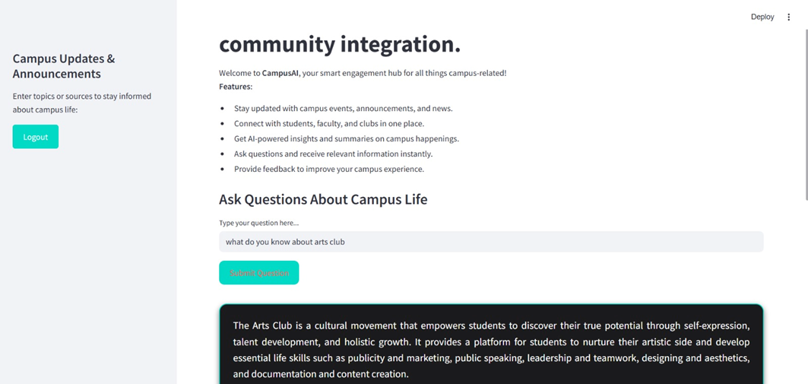

# 🎓 CampusAI

### AI-Powered Smart Campus Engagement Platform

CampusAI is an AI-driven student engagement platform designed to simplify how students discover campus events, clubs, academic activities, announcements, and institutional information through conversational AI.

Instead of browsing scattered notice boards, WhatsApp groups, or fragmented portals, students can interact naturally with an intelligent assistant to retrieve contextual campus information instantly.

The project explores Retrieval-Augmented Generation (RAG), semantic search, vector embeddings, and conversational AI workflows to improve campus accessibility and engagement.

---

# ✨ Features

- 🤖 AI-powered campus assistant
- 🔎 Semantic search using vector embeddings
- 🧠 Retrieval-Augmented Generation (RAG)
- 💬 Conversational AI workflows
- 📚 Campus information retrieval
- 🏛️ Club and event discovery
- 📢 Announcement and update system
- 🔐 Authentication workflows
- 🖥️ Interactive student dashboard

---

# 🖼️ Product Preview

## Landing Page & Authentication

Modern landing page with authentication workflows for student access and onboarding.



---

## About & Feature Highlights

CampusAI provides students with an intelligent interface for discovering campus activities, clubs, announcements, and AI-powered insights.



---

## AI-Powered Student Dashboard

Centralized dashboard for interacting with campus updates, announcements, and conversational AI workflows.



---

## Conversational Query Interface

Students can ask natural language questions and receive contextual campus information in real time.

Example:
- “What do you know about the arts club?”
- “What events are happening this weekend?”
- “Tell me about upcoming workshops.”



---

# 🏗️ System Architecture

CampusAI follows a Retrieval-Augmented Generation (RAG) workflow designed for semantic retrieval and contextual response generation.

```text
User Query
      ↓
Embedding Generation
      ↓
Vector Similarity Search
      ↓
Retrieve Relevant Context
      ↓
Context Injection
      ↓
LLM Response Generation
      ↓
AI Response to User
```

---

# 🧠 Core AI Concepts Used

## Retrieval-Augmented Generation (RAG)

CampusAI combines:
- semantic retrieval
- vector search
- contextual document retrieval
- LLM-powered response generation

to improve factual accuracy and contextual awareness.

---

## Vector Embeddings

Campus-related documents and user queries are converted into dense vector embeddings for semantic similarity matching.

---

## Semantic Search

The system retrieves contextually relevant campus information instead of relying only on keyword matching.

---

## Conversational AI

The assistant enables natural language interaction for improved accessibility and student engagement.

---

# 🛠️ Tech Stack

## Frontend
- Streamlit
- HTML5
- CSS3

## Backend
- Flask
- Python

## AI / NLP
- LangChain
- Sentence Transformers
- RetrievalQA Chains
- Groq LLM API

## Vector Database
- FAISS

## Authentication
- SQLite
- Werkzeug Security

---

# 📂 Repository Structure

```text
CampusAI/
│
├── assets/
│   ├── campusai-landing.png
│   ├── campusai-features.png
│   ├── campusai-dashboard.png
│   └── campusai-query.png
│
└── README.md
```

---

# 📖 Project Scope

CampusAI was developed as an AI-driven academic project focused on improving how students interact with campus information through conversational AI and semantic retrieval systems.

The project explores:
- Retrieval-Augmented Generation (RAG)
- vector databases
- semantic search
- conversational AI
- intelligent information retrieval
- student engagement systems

The repository currently serves as a project showcase containing:
- UI workflows
- architecture concepts
- AI interaction flows
- semantic retrieval design
- implementation documentation

---

# 🚀 Future Enhancements

- Real-time campus event APIs
- Personalized student recommendations
- Voice-based interaction
- Multi-language support
- Mobile application support
- Club registration workflows
- AI-powered personalization
- Notification systems
- Admin management dashboard

---

# 👩‍💻 Authors

- M. Sri Vyshnavi
- B. Snigdha Reddy
- P. Tarun Vaibhav

Department of Computer Science & Engineering  
Sreenidhi Institute of Science and Technology

---

# 📜 License

This project is intended for academic and educational purposes.
